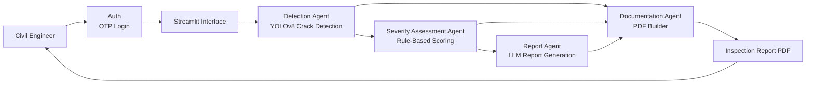
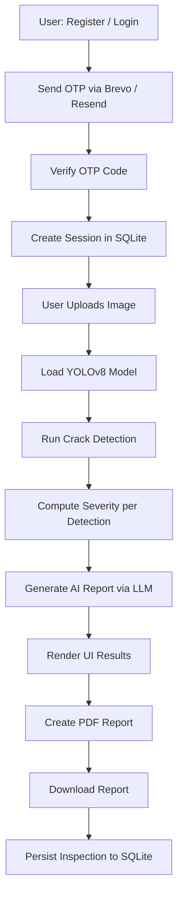

# Phani's Civil-AI-Agent

## About this Civil-AI-Agent
Phani's Civil-AI-Agent is a secure, multi-user infrastructure inspection platform built with Streamlit. Authenticated users upload civil infrastructure images, which are processed through a YOLO crack-detection model, a rule-based severity scorer, and an LLM to produce a downloadable PDF inspection report.

The app combines:
- Email-based OTP authentication with SQLite-backed session management
- Computer vision for defect detection (YOLOv8)
- Rule-based severity scoring
- LLM-assisted report generation (GitHub Models / OpenAI-compatible)
- PDF export for inspection documentation
- Role-based access (user / admin)

## Project Structure

```
civil-ai-agent/
├── app/
│   ├── main.py                   # Composition root (AppContainer DI wiring)
│   ├── config/
│   │   └── settings.py           # AppSettings frozen dataclass + load_settings()
│   ├── data/
│   │   └── repository.py         # SQLiteRepository — all DB operations
│   ├── services/
│   │   ├── auth_service.py       # OTP issuance, session creation, profile validation
│   │   ├── email_service.py      # Brevo (primary) + Resend (fallback) email delivery
│   │   └── inspection_service.py # YOLO detection, AI report, PDF generation
│   ├── ui/
│   │   └── streamlit_app.py      # CivilAIStreamlitApp — all page renderers
│   ├── ai_report.py              # LLM report generation helper
│   ├── model.py                  # YOLO model loader helper
│   ├── pdf.py                    # ReportLab PDF builder helper
│   └── severity.py               # Severity calculation helper
├── app_data/                     # Runtime data (SQLite DB, uploads, reports) — gitignored
├── samples/                      # Sample inspection images
├── images/                       # Static assets (header logo)
├── pyproject.toml                # uv / local dependencies
├── requirements.txt              # Streamlit Cloud dependencies
├── packages.txt                  # Debian apt packages for Streamlit Cloud
├── runtime.txt                   # Python version pin for Streamlit Cloud
└── .streamlit/                   # Streamlit config and secrets
```

## Description of AI Agents for Physical Civil Engineer
Civil-AI-Agent can be viewed as a set of collaborating AI agents that help a physical civil engineer during inspection and reporting workflows:

1. **Detection Agent**
	- Detects visible cracks from uploaded site images using a YOLOv8 model.
	- Produces bounding boxes and confidence scores for each finding.

2. **Severity Assessment Agent**
	- Applies engineering-oriented rules (damage area ratio + confidence) to classify findings into Low, Medium, and High severity.
	- Helps prioritize urgent field attention.

3. **Report Agent**
	- Converts detected findings into a structured professional narrative (summary, causes, recommendations, preventive actions).
	- Supports consistent and faster documentation.

4. **Documentation Agent**
	- Assembles visual evidence and generated analysis into a downloadable PDF report.
	- Improves communication with site teams, clients, and management.

## Benefits of Using this Application
1. **Secure multi-user access** — email OTP login with 24-hour sessions and audit logging.
2. **Faster field reporting** — reduces manual inspection note-taking and report writing time.
3. **Better consistency** — produces standardized outputs across projects and inspectors.
4. **Improved decision support** — highlights high-severity defects to support maintenance prioritization.
5. **Stronger traceability** — keeps image-based evidence and narrative recommendations together in one document.
6. **Practical usability** — runs locally or deploys on Streamlit Community Cloud.

## AI Agents Orchestration Diagram (Mermaid)


## How to Test the AI Agent
- https://phani-civil-ai.streamlit.app/

## High Level Functional Overview
1. User registers/logs in via email OTP (6-digit code, valid 10 minutes).
2. Authenticated session is stored in SQLite (24-hour expiry).
3. User uploads one or more infrastructure images.
4. The app loads a YOLOv8 crack detection model (Hugging Face model if available, fallback model otherwise).
5. Each image is processed to detect crack bounding boxes and confidence scores.
6. A severity level is assigned per detection using area ratio and confidence.
7. A structured civil inspection report is generated by an LLM.
8. The user reviews detected results and downloads a PDF report.
9. All inspections are persisted to SQLite for history and admin review.

## Mermaid Functional Diagram


## Project Configuration

### Environment Variables
Create a `.env` file in the project root with:

```env
# LLM and model
OPENAI_TOKEN=your_openai_compatible_token
HF_TOKEN=your_huggingface_token

# Email — Brevo (primary)
BREVO_API_KEY=your_brevo_api_key
BREVO_FROM_EMAIL=your_verified_sender@example.com
BREVO_FROM_NAME=Civil-AI-Agent

# Email — Resend (fallback)
RESEND_API_KEY=your_resend_api_key
EMAIL_FROM=onboarding@resend.dev

# Admin bootstrap
ADMIN_SEED_EMAIL=your_admin_email@example.com
```

Notes:
- Keep `.env` local only. Do not commit secrets.
- `HF_TOKEN` is optional if you use a local/fallback model.
- **Brevo is the primary email provider.** `BREVO_API_KEY` and `BREVO_FROM_EMAIL` are required for production.
- `RESEND_API_KEY` / `EMAIL_FROM` are used as fallback if Brevo delivery fails.
- `ADMIN_SEED_EMAIL` bootstraps the admin role on first run.

### Install Dependencies
For local development, this project uses `uv` with dependencies declared in `pyproject.toml`.

```bash
uv sync
```

Run the app:

```bash
uv run streamlit run app/main.py
```

## How to Get API Tokens (Free Access)

### Brevo Free Account (Used as BREVO_API_KEY)
Brevo is the primary transactional email provider.

1. Sign up at [https://www.brevo.com](https://www.brevo.com) (free tier available).
2. Go to `Account` → `SMTP & API` → `API Keys`.
3. Create a new API key.
4. Verify a sender email address under `Senders & IPs` → `Senders`.
5. Add to `.env`:

```env
BREVO_API_KEY=your_brevo_api_key
BREVO_FROM_EMAIL=your_verified_sender@example.com
BREVO_FROM_NAME=Civil-AI-Agent
```

### Resend Free Tier (Used as fallback RESEND_API_KEY)
1. Sign up at [https://resend.com](https://resend.com).
2. Create an API key from the dashboard.
3. Add to `.env`:

```env
RESEND_API_KEY=your_resend_api_key
EMAIL_FROM=onboarding@resend.dev
```

### GitHub Models Free Access (Used as OPENAI_TOKEN)
This app uses an OpenAI-compatible client pointed at `https://models.github.ai/inference`.

1. Sign in to GitHub.
2. Go to `Settings` → `Developer settings` → `Personal access tokens`.
3. Create a fine-grained or classic PAT with Models inference access.
4. Add to `.env`:

```env
OPENAI_TOKEN=your_github_models_token
```

Note: GitHub free access limits can apply depending on your account and current GitHub Models quota.

### Hugging Face Free Access Token (Used as HF_TOKEN)
1. Create or sign in at [https://huggingface.co](https://huggingface.co).
2. Open [https://huggingface.co/settings/tokens](https://huggingface.co/settings/tokens).
3. Click `New token` with at least `Read` permission.
4. Add to `.env`:

```env
HF_TOKEN=your_huggingface_read_token
```

### Python Version
Use Python `3.12` locally and in Streamlit Community Cloud.

## How to Configure and Run on Windows

```powershell
py -3.12 -m venv .venv
.\.venv\Scripts\Activate.ps1
uv sync
uv run streamlit run app/main.py
```

## How to Configure and Run on macOS

```bash
python3.12 -m venv .venv
source .venv/bin/activate
uv sync
uv run streamlit run app/main.py
```

## How to Deploy on Streamlit Cloud Server
1. Push this repository to GitHub.
2. Sign in to Streamlit Community Cloud.
3. Click **New app** and select your GitHub repo and branch.
4. Set **Main file path** to `app/main.py`.
5. Ensure the repository contains these deployment files in the root:
	- `requirements.txt` — Netlify/host entry point that delegates to `requirements-netlify.txt`
	- `requirements-netlify.txt` — lean Python dependency set for Netlify deployments
	- `packages.txt` — Debian apt dependencies
	- `.python-version` and `runtime.txt` pinned to Python `3.12`

6. Add secrets in the Streamlit app settings (`Secrets` tab):

```toml
OPENAI_TOKEN = "your_openai_compatible_token"
HF_TOKEN = "your_huggingface_token"

BREVO_API_KEY = "your_brevo_api_key"
BREVO_FROM_EMAIL = "your_verified_sender@example.com"
BREVO_FROM_NAME = "Civil-AI-Agent"

RESEND_API_KEY = "your_resend_api_key"
EMAIL_FROM = "onboarding@resend.dev"

ADMIN_SEED_EMAIL = "your_admin_email@example.com"
```

7. Deploy and verify: registration, OTP email delivery, inspection upload, AI report, and PDF download.

### Streamlit Community Cloud Dependency Notes
This repository uses different dependency strategies for local development and cloud deployment:

- **Local development**: `uv` + `pyproject.toml`
- **Streamlit Community Cloud**: `requirements.txt` + `packages.txt`

This is intentional. Streamlit Community Cloud gave more reliable builds with `requirements.txt` to enforce `opencv-python-headless` and `packages.txt` containing:

```text
libgl1
```

This avoids OpenCV GUI dependency issues during deployment.

### Optional Local Streamlit Secrets
To test Streamlit secrets locally instead of `.env`, create `.streamlit/secrets.toml`:

```toml
OPENAI_TOKEN = "your_openai_compatible_token"
HF_TOKEN = "your_huggingface_token"

BREVO_API_KEY = "your_brevo_api_key"
BREVO_FROM_EMAIL = "your_verified_sender@example.com"
BREVO_FROM_NAME = "Civil-AI-Agent"

RESEND_API_KEY = "your_resend_api_key"
EMAIL_FROM = "onboarding@resend.dev"

ADMIN_SEED_EMAIL = "your_admin_email@example.com"
```

## Troubleshooting

### Streamlit Cloud fails on `from ultralytics import YOLO`
If the app fails during startup while importing `YOLO` or `cv2`:

1. Confirm deployment is using Python `3.12`.
2. Confirm the repository contains root-level `requirements.txt`.
3. Confirm the repository contains root-level `packages.txt`.
4. Confirm `uv.lock` is **not** committed to the repository (Streamlit Cloud may prefer it over `requirements.txt`).

### Error: `ImportError: libGL.so.1: cannot open shared object file`
Fix: Ensure [packages.txt](packages.txt) exists in the repository root and contains:

```text
libgl1
```

### Error: `opencv` or `cv2` import issues on Streamlit Cloud
Use [requirements.txt](requirements.txt) in the repository root with:

```text
opencv-python-headless>=4.8.0
streamlit
pillow
numpy
reportlab
openai
huggingface_hub
python-dotenv
resend
sib-api-v3-sdk
```

### Netlify build runs out of disk space while installing `nvidia_*` or `torch`
Cause: `ultralytics` pulls the PyTorch stack, and recent Linux wheels can pull large CUDA-related packages that exceed Netlify's build disk limits.

Fix:

1. Keep root-level [requirements.txt](requirements.txt) lean for Netlify deployments.
2. Netlify installs from [requirements.txt](requirements.txt), which now delegates to [requirements-netlify.txt](requirements-netlify.txt).
3. The app now handles a missing detection stack by showing a message on the Inspect page instead of crashing.

For full crack-detection capability, use a Python host better suited to ML workloads and install the full app dependency set locally or on that host.

### Email verification OTP not received
1. Check that `BREVO_API_KEY` is set and valid.
2. Check that `BREVO_FROM_EMAIL` is a verified sender in your Brevo account.
3. If Brevo is not configured, the app falls back to Resend — ensure `RESEND_API_KEY` is set.
4. For Resend testing without a verified domain, use `EMAIL_FROM=onboarding@resend.dev`.

### App deploys but secrets are missing
If the app starts but fails on report generation or model download:

1. Open your Streamlit app settings → `Secrets`.
2. Verify all tokens are present (`OPENAI_TOKEN`, `HF_TOKEN`, `BREVO_API_KEY`, etc.).

### Local app works but cloud deployment fails
This project intentionally uses different dependency strategies:

- Local: `uv sync` and `uv run`
- Streamlit Cloud: `requirements.txt` and `packages.txt`

Do not assume the local `uv` setup will behave identically to the cloud builder.

## Tech Stack
- **Python 3.12**
- **Streamlit** — UI framework
- **Ultralytics YOLOv8** — crack detection
- **Hugging Face Hub** — model distribution
- **GitHub Models / OpenAI-compatible API** — LLM report generation
- **Brevo (`sib-api-v3-sdk`)** — transactional email (primary)
- **Resend** — transactional email (fallback)
- **SQLite** — user, session, inspection, and audit persistence
- **ReportLab** — PDF report generation
- **Pillow / NumPy** — image processing
- **uv** — package management

## Author
- Name: Phani B
- Email: phani.dummy@hotmail.com
