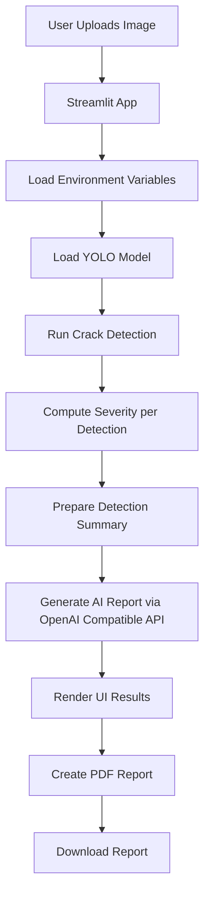

# Civil-AI-Agent

## About this Civil-AI-Agent
Civil-AI-Agent is an interactive infrastructure inspection application built with Streamlit. It analyzes uploaded civil infrastructure images, detects visible cracks using YOLO, estimates severity, generates an AI-based engineering report, and allows report download as PDF.

The app combines:
- Computer vision for defect detection (YOLO)
- Rule-based severity scoring
- LLM-assisted report generation
- PDF export for inspection documentation

## High Level Functional Overview
1. User uploads one or more infrastructure images.
2. The app loads a YOLO crack detection model (Hugging Face model if available, fallback model otherwise).
3. Each image is processed to detect crack bounding boxes and confidence scores.
4. A severity level is assigned per detection using area ratio and confidence.
5. A structured civil inspection report is generated by an LLM.
6. The user reviews detected results and downloads a PDF report.

## Mermaid Functional Diagram


## Project Configuration

### Environment Variables
Create a `.env` file in the project root with:

```env
OPENAI_TOKEN=your_openai_compatible_token
HF_TOKEN=your_huggingface_token
```

Notes:
- Keep `.env` local only. Do not commit secrets.
- `HF_TOKEN` is optional if you use a local/fallback model.

### Install Dependencies
This project uses `pyproject.toml` and `uv.lock`, so install dependencies with `uv`.

With uv:
```bash
uv sync
```

Run commands through uv:
```bash
uv run streamlit run app/main.py
```

## How to Get API Tokens (Free Access)

### GitHub Models Free Access (Used as OPENAI_TOKEN)
This app uses an OpenAI-compatible client with `base_url=https://models.github.ai/inference`, so `OPENAI_TOKEN` should be a GitHub token with access to GitHub Models.

1. Sign in to GitHub.
2. Go to GitHub token settings:
	1. `Settings` -> `Developer settings` -> `Personal access tokens`.
	2. Create either fine-grained PAT or classic PAT.
3. Ensure the token includes permission to use GitHub Models inference (for fine-grained PAT, enable Models read/inference access as available in your account UI).
4. Copy the generated token.
5. Add it to `.env` as:

```env
OPENAI_TOKEN=your_github_models_token
```

6. Test by running:

```bash
uv run streamlit run app/main.py
```

Note: GitHub free access limits can apply depending on your account and current GitHub Models quota.

### Hugging Face Free Access Token (Used as HF_TOKEN)
1. Create or sign in to your Hugging Face account at `https://huggingface.co`.
2. Open token settings at `https://huggingface.co/settings/tokens`.
3. Click `New token`.
4. Choose at least `Read` permission.
5. Create and copy the token.
6. Add it to `.env` as:

```env
HF_TOKEN=your_huggingface_read_token
```

7. Re-run the app:

```bash
uv run streamlit run app/main.py
```

## How to Configure and Run on Windows
1. Open PowerShell in the project directory.
2. Create and activate a virtual environment.
3. Install dependencies.
4. Configure `.env`.
5. Run Streamlit.

Commands:
```powershell
python -m venv .venv
.\.venv\Scripts\Activate.ps1
uv sync
uv run streamlit run app/main.py
```

## How to Configure and Run on macOS
1. Open Terminal in the project directory.
2. Create and activate a virtual environment.
3. Install dependencies.
4. Configure `.env`.
5. Run Streamlit.

Commands:
```bash
python3 -m venv .venv
source .venv/bin/activate
uv sync
uv run streamlit run app/main.py
```

## How to Deploy on Streamlit Cloud Server
1. Push this repository to GitHub.
2. Sign in to Streamlit Community Cloud.
3. Click New app and select your GitHub repo and branch.
4. Set Main file path to `app/main.py`.
5. Add secrets in Streamlit app settings:

```toml
OPENAI_TOKEN = "your_openai_compatible_token"
HF_TOKEN = "your_huggingface_token"
```

6. Deploy the app.
7. Verify upload, detection, AI report generation, and PDF download.

## Tech Stack
- Python
- Streamlit
- Ultralytics YOLO
- Hugging Face Hub
- OpenAI-compatible chat completion client
- ReportLab
- Pillow
- NumPy

## Author
- Name: Phani B
- Email: phani.dummy@hotmail.com
