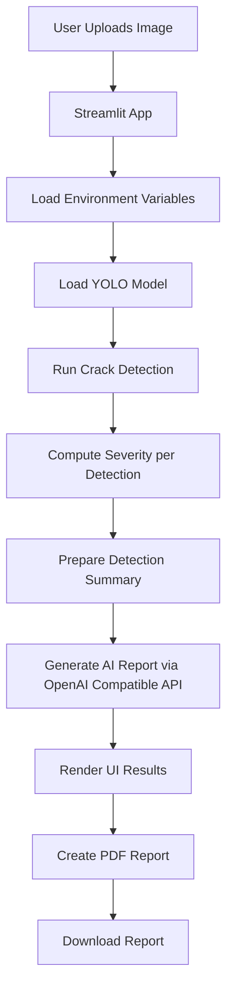

# Civil-AI-Agent

## About this Civil-AI-Agent
Civil-AI-Agent is an interactive infrastructure inspection application built with Streamlit. It analyzes uploaded civil infrastructure images, detects visible cracks using YOLO, estimates severity, generates an AI-based engineering report, and allows report download as PDF.

The app combines:
- Computer vision for defect detection (YOLO)
- Rule-based severity scoring
- LLM-assisted report generation
- PDF export for inspection documentation

## High Level Functional Overview
1. User uploads one or more infrastructure images.
2. The app loads a YOLO crack detection model (Hugging Face model if available, fallback model otherwise).
3. Each image is processed to detect crack bounding boxes and confidence scores.
4. A severity level is assigned per detection using area ratio and confidence.
5. A structured civil inspection report is generated by an LLM.
6. The user reviews detected results and downloads a PDF report.

## Mermaid Functional Diagram


## Project Configuration

### Environment Variables
Create a `.env` file in the project root with:

```env
OPENAI_TOKEN=your_openai_compatible_token
HF_TOKEN=your_huggingface_token
```

Notes:
- Keep `.env` local only. Do not commit secrets.
- `HF_TOKEN` is optional if you use a local/fallback model.

### Install Dependencies
For local development, this project is intended to be run with `uv` using the dependencies declared in `pyproject.toml`.

With uv:
```bash
uv sync
```

Run commands through uv:
```bash
uv run streamlit run app/main.py
```

## How to Get API Tokens (Free Access)

### GitHub Models Free Access (Used as OPENAI_TOKEN)
This app uses an OpenAI-compatible client with `base_url=https://models.github.ai/inference`, so `OPENAI_TOKEN` should be a GitHub token with access to GitHub Models.

1. Sign in to GitHub.
2. Go to GitHub token settings:
	1. `Settings` -> `Developer settings` -> `Personal access tokens`.
	2. Create either fine-grained PAT or classic PAT.
3. Ensure the token includes permission to use GitHub Models inference (for fine-grained PAT, enable Models read/inference access as available in your account UI).
4. Copy the generated token.
5. Add it to `.env` as:

```env
OPENAI_TOKEN=your_github_models_token
```

6. Test by running:

```bash
uv run streamlit run app/main.py
```

Note: GitHub free access limits can apply depending on your account and current GitHub Models quota.

### Hugging Face Free Access Token (Used as HF_TOKEN)
1. Create or sign in to your Hugging Face account at `https://huggingface.co`.
2. Open token settings at `https://huggingface.co/settings/tokens`.
3. Click `New token`.
4. Choose at least `Read` permission.
5. Create and copy the token.
6. Add it to `.env` as:

```env
HF_TOKEN=your_huggingface_read_token
```

7. Re-run the app:

```bash
uv run streamlit run app/main.py
```

### Python Version
Use Python `3.12` locally and in Streamlit Community Cloud.

## How to Configure and Run on Windows
1. Open PowerShell in the project directory.
2. Make sure Python `3.12` is installed.
3. Create and activate a virtual environment.
4. Install dependencies with `uv`.
5. Configure `.env`.
6. Run Streamlit.

Commands:
```powershell
py -3.12 -m venv .venv
.\.venv\Scripts\Activate.ps1
uv sync
uv run streamlit run app/main.py
```

## How to Configure and Run on macOS
1. Open Terminal in the project directory.
2. Make sure Python `3.12` is installed.
3. Create and activate a virtual environment.
4. Install dependencies with `uv`.
5. Configure `.env`.
6. Run Streamlit.

Commands:
```bash
python3.12 -m venv .venv
source .venv/bin/activate
uv sync
uv run streamlit run app/main.py
```

## How to Deploy on Streamlit Cloud Server
1. Push this repository to GitHub.
2. Sign in to Streamlit Community Cloud.
3. Click New app and select your GitHub repo and branch.
4. Set Main file path to `app/main.py`.
5. Ensure the repository contains these deployment files in the root:

	- `requirements.txt` for Python dependencies
	- `packages.txt` for Debian apt dependencies
	- `.python-version` and `runtime.txt` pinned to Python `3.12`

6. Add secrets in Streamlit app settings:

```toml
OPENAI_TOKEN = "your_openai_compatible_token"
HF_TOKEN = "your_huggingface_token"
```

7. Deploy the app.
8. Verify upload, detection, AI report generation, and PDF download.

### Streamlit Community Cloud Dependency Notes
This repository uses different dependency strategies for local development and cloud deployment:

- Local development: `uv` + `pyproject.toml`
- Streamlit Community Cloud: `requirements.txt` + `packages.txt`

This is intentional. Streamlit Community Cloud gave more reliable builds with:

- `requirements.txt` to force `opencv-python-headless`
- `packages.txt` containing:

```text
libgl1
```

This avoids OpenCV GUI dependency issues during deployment.

### Optional Local Streamlit Secrets
If you want to test Streamlit secrets locally instead of `.env`, create `.streamlit/secrets.toml`:

```toml
OPENAI_TOKEN = "your_openai_compatible_token"
HF_TOKEN = "your_huggingface_token"
```

## Troubleshooting

### Streamlit Cloud fails on `from ultralytics import YOLO`
If the app fails during startup while importing `YOLO` or `cv2`, check the following:

1. Confirm deployment is using Python `3.12`.
2. Confirm the repository contains root-level `requirements.txt`.
3. Confirm the repository contains root-level `packages.txt`.
4. Confirm `uv.lock` is not committed to the repository.

Reason:
- Streamlit Community Cloud may prefer `uv.lock` over `requirements.txt` if both are present.
- For this app, `requirements.txt` is required so deployment uses `opencv-python-headless` instead of GUI-linked OpenCV builds.

### Error: `ImportError: libGL.so.1: cannot open shared object file`
This means the Linux system dependency for OpenCV is missing.

Fix:
- Ensure [packages.txt](packages.txt) exists in the repository root.
- Ensure it contains:

```text
libgl1
```

### Error: `opencv` or `cv2` import issues on Streamlit Cloud
Use [requirements.txt](requirements.txt) in the repository root with:

```text
opencv-python-headless>=4.8.0
ultralytics
streamlit
pillow
numpy
reportlab
openai
huggingface_hub
python-dotenv
```

### App deploys but secrets are missing
If the app starts but fails when generating reports or downloading the model:

1. Open your Streamlit app settings.
2. Go to `Secrets`.
3. Add:

```toml
OPENAI_TOKEN = "your_github_models_token"
HF_TOKEN = "your_huggingface_token"
```

### Local app works but cloud deployment fails
This project intentionally uses different dependency strategies:

1. Local: `uv sync` and `uv run`
2. Streamlit Cloud: `requirements.txt` and `packages.txt`

Do not assume the local `uv` setup will behave identically to the cloud builder.

## Tech Stack
- Python
- Streamlit
- Ultralytics YOLO
- Hugging Face Hub
- OpenAI-compatible chat completion client
- ReportLab
- Pillow
- NumPy

## Author
- Name: Phani B
- Email: phani.dummy@hotmail.com
